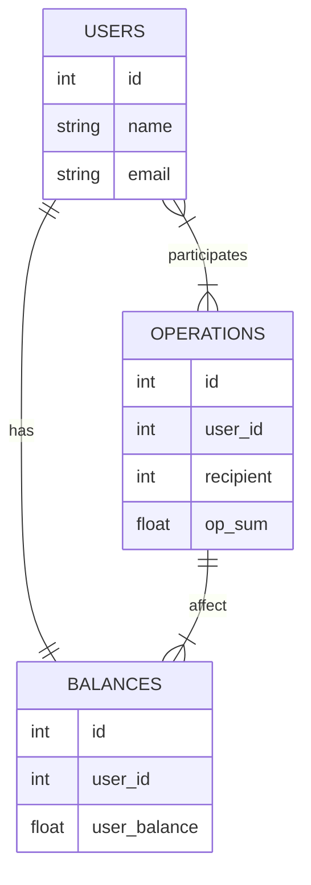

# UserBalance

Тестовый проект для отображения баланса пользователей

## Используемые технологии

* [Laravel 8.0](https://laravel.com/)
* [PostgreSQL 12](https://www.postgresql.org/)
* [Vue 2](https://vuejs.org/)
* [Bootstrap](https://getbootstrap.com/)


## Запуск
### Настройка БД

В проекте использована СУБД [Postgres](https://www.postgresql.org/).

* Команды для настройки (Shell):

```shell
# Установка Postgres
sudo sh -c 'echo "deb http://apt.postgresql.org/pub/repos/apt $(lsb_release -cs)-pgdg main" > /etc/apt/sources.list.d/pgdg.list'
wget --quiet -O - https://www.postgresql.org/media/keys/ACCC4CF8.asc | sudo apt-key add -
sudo apt-get update
sudo apt-get -y install postgresql

# Логин под системным пользователем и переход в интерактивный режим
sudo -u postgres psql
```

* Команды в интерактивном режиме:

```
CREATE DATABASE user_balance;

CREATE USER balance_accounter WITH ENCRYPTED PASSWORD 'password';

GRANT ALL PRIVILEGES ON DATABASE user_balance TO balance_accounter;
```

## Структура БД
