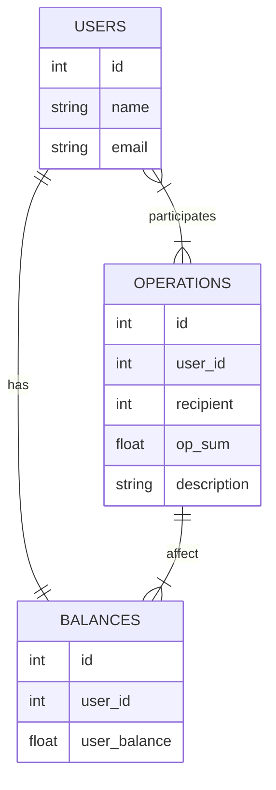

# UserBalance

Тестовый проект для отображения баланса пользователей

## Используемые технологии

* [Laravel 8.0](https://laravel.com/)
* [Laravel Mix](https://laravel-mix.com/)
* [Laravel Sanctum](https://laravel.com/docs/9.x/sanctum)
* [PostgreSQL 12](https://www.postgresql.org/)
* [Vue 2](https://v2.vuejs.org/)
* [Vue Router](https://router.vuejs.org/)
* [Axios](https://axios-http.com/ru/)
* [Bootstrap](https://getbootstrap.com/)

## Запуск
### Настройка БД

В проекте использована СУБД [Postgres](https://www.postgresql.org/).

Создание БД и пользователя:

```
CREATE DATABASE user_balance;

CREATE USER balance_accounter WITH ENCRYPTED PASSWORD 'password';

GRANT ALL PRIVILEGES ON DATABASE user_balance TO balance_accounter;
```

## Структура БД


## API

<details>
    <summary>Аутентификация (<i><u>/api/login</u></i>)</summary>

**Запрос**

``` json
{
    "email": "email@example.com",
    "password": "anyPassword"
}
```

**Ответ**

``` json
{
    "token": "t0k3n"
}
```

</details>

<details>
    <summary>Проверка, авторизован ли пользователь (<i><u>/api/login/check</u></i>)</summary>

**Запрос**

``` json
{}
```

**Ответ**

``` json
{
    "isLoggedIn": 1,
    "user": "Test User"
}
```

</details>

<details>
    <summary>Получить баланс пользователя (<i><u>/api/balance</u></i>)</summary>

**Запрос**

``` json
{}
```

**Ответ**

``` json
{
    "balance": 10000.00
}
```

</details>

<details>
    <summary>Получить операции с участием пользователя (<i><u>/api/operations</u></i>)</summary>

**Запрос (последние 5 операций)**

``` json
{
    "last": 5
}
```

**Запрос (все)**

``` json
{}
```

**Ответ**

``` json
[
    {
        "created_at": "2022-10-24T19:59:20.000000Z",
        "sender": "Test User",
        "recipient": "Test User2",
        "sum": "500",
        "description": "sample description"
    },
    {
        "created_at": "2022-10-24T19:59:20.000000Z",
        "sender": "Test User",
        "recipient": "Test User2",
        "sum": "500",
        "description": "sample description"
    },
    {
        "created_at": "2022-10-24T19:59:20.000000Z",
        "sender": "Test User",
        "recipient": "Test User2",
        "sum": "500",
        "description": "sample description"
    },
    {
        "created_at": "2022-10-24T19:59:20.000000Z",
        "sender": "Test User",
        "recipient": "Test User2",
        "sum": "500",
        "description": "sample description"
    },
    {
        "created_at": "2022-10-24T19:59:20.000000Z",
        "sender": "Test User",
        "recipient": "Test User2",
        "sum": "500",
        "description": "sample description"
    },
]
```

</details>

<details>
    <summary>Завершение работы под пользователем (<i><u>/api/logout</u></i>)</summary>

**Запрос**

``` json
{}
```

**Ответ**

``` json
[]
```

</details>

## Команды php artisan

* Создание пользователя
  
  `php artisan user:create "Mr. User" user@example.com password`

* Создание операции
  
  `php artisan operation:create user1@example.com user2@example.com 1000.05 "Happy birthday!"`
